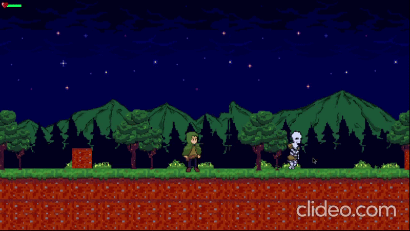

# Tear of Hypatia: 2D Action-Platformer

A 2D action-platformer game developed as a collaborative milestone within the Raion Community. Players navigate a linear progression loop, engaging unique enemy encounters that culminate in a dynamic, multi-phase boss fight. 



## 👥 Contributors

This project was made possible thanks to the hard work and dedication of our team members:
* **[Peter Abednego Wijaya](https://github.com/Peteraw203)** - Game Designer / Writer
* **[Muhammad Gilang Hafizh](https://www.linkedin.com/in/gilang-hafizh)** - Game Designer / Writer
* **[A. Agung Nugrah Bayu Widia Putra](https://github.com/Kyouun7)** - Lead Programmer / Systems Engineer
* **[Ananda Muhammad Reza](https://github.com/anandamreza)** - Enemy AI & Combat Programmer
* **[Muhammad Rizky Ramadhan](https://www.linkedin.com/in/muhammadrizkyram)** - 2D Technical Artist

## 🚀 Key Features (My Contributions)

* **Autonomous Enemy FSM:** Engineered a robust Finite State Machine (FSM) to govern autonomous behaviors (Patrol, Chase, Attack) for both melee and ranged enemy variants.
* **Asynchronous Timing Loops:** Utilized C# Coroutines (`IEnumerator` and `WaitForSeconds`) to handle non-blocking structural delays during state transitions and roaming path points without spiking the frame rate.
* **Health-Gated Boss Phases:** Architected a dynamic combat phase system for the final boss encounter (`bossScript.cs`), triggering behavioral and projectile pattern shifts based on absolute health thresholds.
* **Target-Tracking Projectiles:** Programmed predictive projectile mechanics (`enemyBullets.cs`) that calculate normalized 2D directional vectors (`Rigidbody2D.linearVelocity`) targeting the player's active transform coordinates.
* **Animation-Spatial Synchronization:** Synchronized 2D animation parameters with real-time spatial data, dynamically manipulating scale matrices (`transform.localScale`) to ensure flawless sprite flipping during active pursuit loops.

## 🛠️ Tech Stack
* **Engine:** Unity 2D
* **Language:** C#
* **Architecture:** Component-Based Architecture, Finite State Machines (FSM)

## 🧠 Core AI Architecture (Snippet)
Here is a look at the core asynchronous looping logic used to manage non-blocking roaming path nodes during the enemy patrol state:

```csharp
private IEnumerator reachPoint()
{
    anim.SetBool("IsEnemyMoving?", false);
    enemyGo = false;
    yield return new WaitForSeconds(idleTime);
    destination = destination == 0 ? 1 : 0;

    enemyGo = true;
    anim.SetBool("IsEnemyMoving?", true);
}